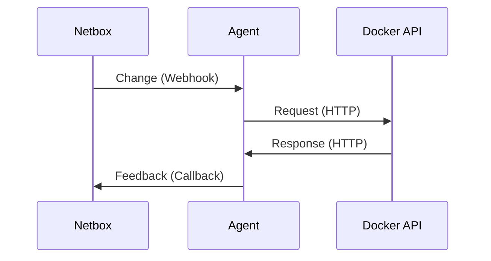

# Netbox Docker Plugin

[](https://github.com/SaaShup/netbox-docker-plugin/actions/workflows/main_ci.yml)

Manage Docker with Netbox & style. Made to work with [netbox-docker-agent](https://github.com/SaaShup/netbox-docker-agent).


## How does it work?



Once the plugin and webhooks are installed, you can:

1. Create hosts that point to
   [agents](https://github.com/SaaShup/netbox-docker-agent) you had installed
2. Retrieve informations from Docker API with the help of the agent
3. Create containers on host with an image, expose ports, add env variables and
   labels, mount volumes, set networks.
4. Manage the container status, start, stop, restart.

## Installation

Below the compatibility list of the Netbox Docker PLugin and Netbox. Please chose the right version of the plugin depending of the Netbox version you use:

| Netbox Version | Netbox Docker Plugin Version |
| -------------- | ---------------------------- |
| 3.\*           | 1.\*                         |
| 4.0.\*         | 2.\*                         |
| 4.1.\*         | 3.\*                         |

You can follow [the official plugins installation
instructions](https://docs.netbox.dev/en/stable/plugins/#installing-plugins).

If needed, source your Netbox's virtual environment and install the plugin like
a package. We assume [you have already installed
Netbox](https://docs.netbox.dev/en/stable/installation/) and its source code are
in `/opt/netbox`:

```bash
cd /opt/netbox
python3 -m venv venv # if virtual env was not created before
source /opt/netbox/venv/bin/activate
pip install netbox-docker-plugin
```

Enable the plugin in the `/opt/netbox/netbox/netbox/configuration.py` file:

```python
PLUGINS = [
    'netbox_docker_plugin',
]
```

Then, run migrations:

```bash
cd /opt/netbox
python3 netbox/manage.py migrate
```

> [!IMPORTANT]
> In order to the communication between your Netbox instance and [the Agent](https://github.com/SaaShup/netbox-docker-agent)
> works, the plugin will check if webhooks to agents are
> presents on each migration phase.
> If not, then the plugin will automatically install webhooks configuration in
> your Netbox instance.

### Alternative

Another way to install Netbox is to use the [Official netbox-docker
project](https://github.com/netbox-community/netbox-docker).

With this alternate way, you can [customize your Netbox image](https://github.com/netbox-community/netbox-docker/wiki/Using-Netbox-Plugins) and migrations will be
automatically execute each time you restart the container.

## Contribute

### Install our development environment

Requirements:
* Python 3.11
* PostgreSQL 15 [Official Netbox doc](https://github.com/netbox-community/netbox/blob/master/docs/installation/1-postgresql.md)
  - user: netbox (with database creation right)
  - password: secret
  - database: netbox
  - port: 5432
* Redis 7.2
  - port: 6379

Set a PROJECT variable :

```
PROJECT="/project/netbox"
```

Create a project directory `$PROJECT`:

```bash
mkdir $PROJECT
```

Go inside your project directory, clone this repository and the Netbox repository:

```bash
cd $PROJECT
git clone git@github.com:SaaShup/netbox-docker-plugin.git
git clone git@github.com:netbox-community/netbox.git
```

Create your venv and activate it:

```bash
python -m venv venv
source venv/bin/activate
```

Install netbox-docker-plugin dependencies:

```bash
cd $PROJECT/netbox-docker-plugin
pip install -e .
```

Configure Netbox and install Netbox dependencies:

```bash
cd $PROJECT/netbox
cp $PROJECT/netbox-docker-plugin/netbox_configuration/configuration_dev.py $PROJECT/netbox/netbox/netbox/configuration.py
pip install -r requirements.txt
```

Run database migrations:

```bash
cd $PROJECT/netbox
python3 netbox/manage.py migrate
```

Create a Netbox super user:

```bash
cd $PROJECT/netbox
python3 netbox/manage.py createsuperuser
```

Start Netbox instance:

```bash
cd $PROJECT/netbox
python3 netbox/manage.py runserver 0.0.0.0:8000 --insecure
```

Visit http://localhost:8000/

### Run tests

After installing your development environment, you can run the tests plugin
(you don't need to start the Netbox instance):

```bash
cd $PROJECT/netbox
python3 -m pip install requests_mock
python3 netbox/manage.py test netbox_docker_plugin.tests --keepdb -v 2
```

With code coverage, install [coverage.py](https://coverage.readthedocs.io/en/7.3.2/) and use it:

```bash
cd $PROJECT/netbox
python3 -m pip install coverage
```

Then run the test with coverage.py and print the report:

```bash
cd $PROJECT/netbox
coverage run --include='*/netbox_docker_plugin/*' netbox/manage.py test netbox_docker_plugin.tests --keepdb -v 2
coverage report -m
```

# Hosting

Check https://saashup.com for more information.
